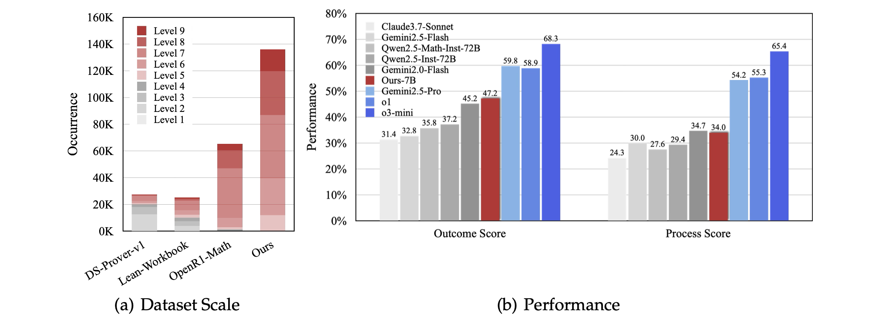

# DeepTheorem: Advancing LLM Reasoning for Theorem Proving Through Natural Language and Reinforcement Learning 🚀


<p align="center">

</p>

Welcome to the GitHub repository for **DeepTheorem** 🎉, a comprehensive framework for enhancing large language model (LLM) mathematical reasoning through informal, natural language-based theorem proving. This project introduces a novel approach to automated theorem proving (ATP) by leveraging the informal reasoning strengths of LLMs, moving beyond traditional formal proof systems 🌟.


## Overview 📖


Theorem proving is a critical benchmark for evaluating complex reasoning in LLMs 🧠. However, formal proof systems often misalign with the informal, natural language knowledge LLMs acquire during pre-training. DeepTheorem addresses this gap by introducing:

1. **A Large-Scale Theorem Dataset** 📊: 
   - Contains **121K high-quality, IMO-level informal theorems and proofs** across diverse mathematical domains 📚.
   - Rigorously annotated for correctness, difficulty, and topic categories ✅.
   - Includes systematically constructed **verifiable theorem variants** for robust evaluation 🔍.
   - [Dataset Link](https://huggingface.co/datasets/Jiahao004/DeepTheorem) 🔗.

2. **RL-Zero Training Pipeline** 🤖: 
   - A novel **reinforcement learning strategy** tailored for informal theorem proving ⚙️.
   - Utilizes verified theorem variants to incentivize robust mathematical inference 💡.

3. **Comprehensive Evaluation Metrics** 📈:
   - Outcome metrics to assess proof correctness ✔️.
   - Process metrics to evaluate the quality of reasoning steps 🛠️.


## Performance 🚀
Deeptheorem achieves the #Rank 5 position along all the commerical models and open source models.

| **Model**             | **FIMO** |         | **HMMT** |         | **Putnam** |         | **Avg.(\#Rank)** |         |
| :--------------------- | :------: | :-----: | :------: | :-----: | :--------: | :-----: | :------: | :-----: |
|                        | *out.*   | *proc.* | *out.*   | *proc.* | *out.*     | *proc.* | *out.*   | *proc.* |
| Gemini2\.5-Pro         | 57\.14   | 54\.06  | 57\.63   | 49\.82  | 64\.58     | 58\.75  | 59\.78(\#2)   | 54\.21(\#3)  |
| o1-mini                | 60\.32   | 55\.23  | 35\.59   | 30\.90  | 61\.46     | 52\.88  | 52\.46(\#4)   | 46\.34(\#4)  |
| o1                     | 66\.67   | 61\.00  | 47\.46   | 47\.30  | 62\.50     | 57\.55  | 58\.88(\#3)   | 55\.28(\#2)  |
| o3-mini                | 80\.95   | 77\.61  | 45\.76   | 43\.47  | 78\.12     | 75\.12  | 68\.28(\#1)   | 65\.40(\#1)  |
| *DeepTheorem-RL-7B     | 55\.56   | 39\.07  | 28\.81   | 20\.85  | 57\.29     | 42\.20  | 47\.22(\#5)   | 34\.04(\#5)  |


## Key Contributions 🌟

- **Dataset** 📚: A large, diverse, and high-quality collection of informal theorems and proofs, enabling scalable training and evaluation of LLMs.
- **RL-Zero Strategy** 🤖: A reinforcement learning approach that significantly enhances LLM performance in informal theorem proving.
- **Evaluation Framework** 📏: Comprehensive metrics for both correctness and reasoning quality, setting a new standard for ATP evaluation.
- **Performance** 🏆: DeepTheorem achieves **state-of-the-art accuracy and reasoning quality**, outperforming existing datasets and supervised fine-tuning protocols.


## DeepTheorem Dataset 📊

The DeepTheorem dataset comprises **121K IMO-level informal theorems and proofs** spanning diverse mathematical domains 🌐. Each theorem-proof pair is rigorously annotated for:
- **o3-mini Proofs** 🖋️: Ensuring mathematical accuracy through proofs generated or verified by the o3-mini model ✅.
- **Truth Value** 🔍: The truth value of the theorem extracted from the o3-mini proofs, indicating whether the theorem is true or false ✔️.
- **Difficulty** 🎚️: Categorized by complexity to suit various LLM capabilities 🧩.
- **Topic Categories** 🗂️: Covering algebra, geometry, number theory, and more 📘.
- **Variants** 🔄: Positive or negative variants of the theorem that share the same or inverse truth value of the original theorem 🔀.

The dataset also includes **verifiable theorem variants**, systematically constructed to enable robust evaluation and training 🔍.

- **Access** 🔗: Download the dataset from [Dataset Link](#) or the `data/` directory.
- **Format** 📄: JSON files with theorem statements, proofs, annotations, and variants.
- **Usage** 🚀: Use the dataset for training, evaluation, or mathematical exploration. See `examples/` for sample theorems and proofs.

## DeepTheorem RL-Zero Training Pipeline ⚙️

The RL-Zero strategy is a reinforcement learning approach tailored for informal theorem proving 🤖. It leverages the dataset’s verified theorem variants to incentivize robust mathematical inference 💡.

- **Implementation** 🛠️: Available in the `models/` directory. See [RL-Zero Documentation](#) for details.
- **Training** 🚂: See [`scripts/README.md`](scripts/README.md) for details.


## Example: Proofs from DeepTheorem Models

### Problem

Let \( P(x) \) be a polynomial of degree \( n > 1 \) with integer coefficients, and let \( k \) be any positive integer. Define the polynomial \( Q(x) = P(P(\ldots P(P(x)) \ldots)) \) with \( k \) pairs of parentheses (i.e., the \( k \)-th iterate of \( P \)). Prove or disprove that \( Q(x) \) has more than \( n \) integer fixed points, where an integer fixed point satisfies \( Q(x) = x \).

### Model Response
```
<think>
 
To determine whether the polynomial \( Q(x) = P(P(\ldots P(P(x)) \ldots)) \) with \( k \) pairs of parentheses has more than \( n \) integer fixed points, we need to analyze the properties of the polynomial \( P \) and how the composition of \( P \) affects its fixed points.\\

First, recall that \( P(x) \) is a polynomial of degree \( n > 1 \) with integer coefficients. The number of integer roots of \( P(x) - x = 0 \) (i.e., the number of integer fixed points of \( P \)) is at most \( n \) by the fundamental theorem of algebra and properties of polynomials. Let's denote the integer fixed points of \( P \) by \( r_1, r_2, \ldots, r_m \), where \( m \leq n \).\\

Now, consider the polynomial \( Q(x) = P(P(\ldots P(P(x)) \ldots)) \) with \( k \) pairs of parentheses. We need to determine the number of integer solutions to the equation \( Q(x) = x \). If \( r \) is an integer fixed point of \( Q \), then \( r \) must be an integer fixed point of some composition of \( P \). Specifically, if \( r \) is a fixed point of \( Q \), there exists some \( m \leq k \) such that \( P^{(m)}(r) = r \), where \( P^{(m)} \) denotes the \( m \)-th iterate of \( P \).\\

The key observation is that the number of integer fixed points of \( Q \) is bounded by the number of integer preperiodic points of \( P \). Since \( P \) is a polynomial of degree \( n \), the number of integer preperiodic points of \( P \) is at most \( n \) for each iterate. However, we need to consider the composition \( Q \) which is the \( k \)-th iterate of \( P \).\\

The polynomial \( Q(x) \) is also of degree \( n^k \), and the number of integer roots of \( Q(x) - x = 0 \) is at most \( n^k \). However, we need to check if it is possible for \( Q(x) \) to have more than \( n \) integer fixed points. Since each application of \( P \) can introduce at most \( n \) new fixed points, the total number of integer fixed points of \( Q \) is still bounded by the number of preperiodic points of \( P \), which is at most \( n \) for each iterate.\\

To be more precise, let's consider the fixed points. If \( r \) is a fixed point of \( Q \), then \( r \) must be a root of the polynomial \( P^k(x) - x \). The polynomial \( P^k(x) - x \) is of degree \( n^k \), and by the fundamental theorem of algebra, it can have at most \( n^k \) roots. However, we are interested in integer roots, and the number of integer roots is at most the number of integer preperiodic points of \( P \), which is at most \( n \) for each iterate.\\

Therefore, the number of integer fixed points of \( Q(x) \) is at most \( n \), the same as the number of integer fixed points of \( P \) for each iterate. Hence, \( Q(x) \) cannot have more than \( n \) integer fixed points.\\

Thus, the statement that \( Q \) has more than \( n \) integer fixed points is false.

</think>

<answer> \boxed{disproved} </answer>
```